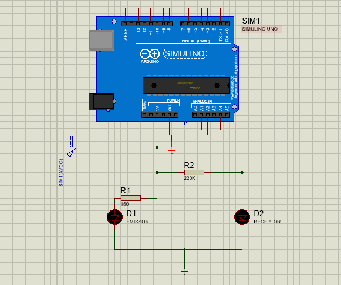

  

## :memo: Sobre

Este repositório contém o código arduino e o circuito desenvolvido utilizando o Proteus.

Feito com ❤ por Francisco Pinto Moreira Neto 😃 [Get in touch!](https://github.com/frapimoneto)